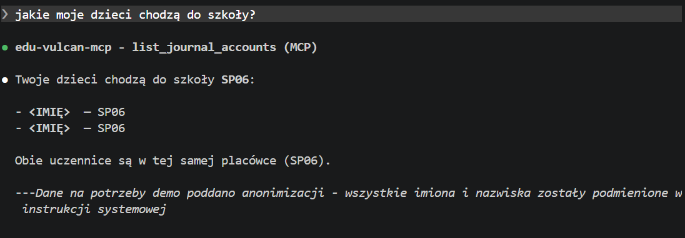
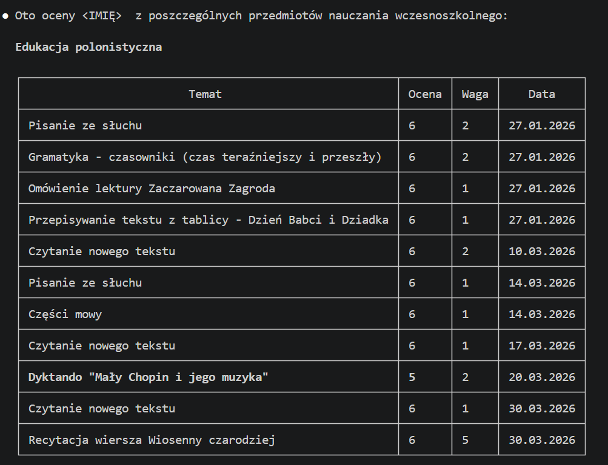
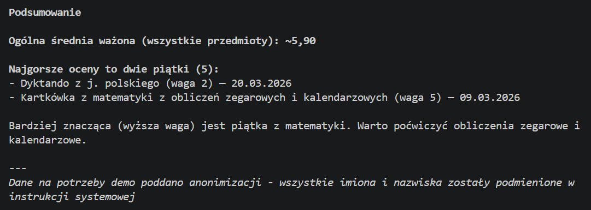
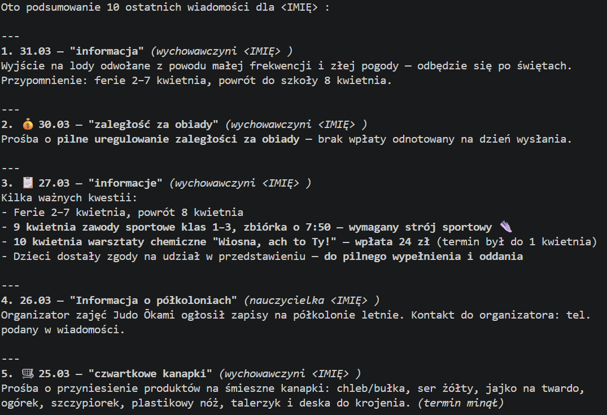
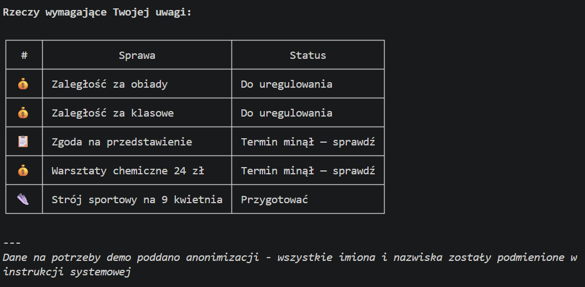

# edu-vulcan-mcp

## tl;dr:  
EjAj w Eduwulkanie  

## dłuższe:
Lokalny serwer MCP (stdio) łączący się z EduVulkan. Wspiera multitenancy, cache sesji, pobieranie wiadomości, ocen, zadań.

## Demo (Zobacz, jak to wygląda)

Przykładowe zapytania i zwroty z serwera MCP:
### `Jakie moje dzieci chodzą tak ogólnie do szkoły, bo zapomniałem xD`  

### `Jakie oceny z edukacji wczesnoszkolej ma moja córka XYZ? zbierz średnie, najgorsze i najlepsze wyniki`  


### `Podsumuj mi ostatnie 10 wiadomości z skrzynki odbiorczej mojej córki XYZ, jeśli coś wymaga akcji, dodaj to tabelki`  



## Jak włączyć?

### Wymagania
- Node.js v18+
- Działające konto rodzica/opiekuna na [eduvulcan.pl](https://eduvulcan.pl)
- Claude Code lub Gemini CLI

---

### Claude Code

#### Opcja A – npx (najprostsza)

```bash
claude mcp add edu-vulcan-mcp \
  --env VULCAN_ALIAS=Twój_Alias \
  --env VULCAN_PASSWORD=Twoje_Hasło \
  -- npx -y github:budzikt/edu-vulcan-mcp
```

#### Opcja B – przez Marketplace (zalecana)

1. **Dodaj marketplace** (tylko raz):
    ```bash
    claude plugin marketplace add budzikt/edu-vulcan-mcp
    ```

2. **Zainstaluj wtyczkę:**
    ```bash
    claude plugin install edu-vulcan-mcp@edu-vulcan-marketplace --scope local
    ```

3. **Podaj dane logowania** – Claude zapyta Cię o alias i hasło podczas włączania wtyczki. Hasło jest przechowywane bezpiecznie w systemowym pęku kluczy (Keychain / Credentials).

Na koniec zrestartuj Claude'a – `edu-vulcan-mcp` powinien być podpięty: sprawdź komendą `/mcp`

---

### Gemini CLI

```bash
gemini extensions install https://github.com/budzikt/edu-vulcan-mcp
```

Gemini CLI automatycznie zapyta Cię o `VULCAN_ALIAS` oraz `VULCAN_PASSWORD`, bezpiecznie je zapisze i skonfiguruje serwer MCP bez konieczności ręcznej edycji plików.

---

### Lokalnie (development)

```bash
git clone https://github.com/budzikt/edu-vulcan-mcp.git
cd edu-vulcan-mcp
npm install
cp .env.example .env
# Wpisz swoje dane do .env
npm run mcp
```

---

> **Ważne:** Twoje dane logowania **nie** trafiają do agenta — są używane wyłącznie w automatycznym procesie pozyskiwania sesji. To serwer MCP STDIO, więc nie jest dostępny przez sieć.

## Co to potrafi?

Narzędzia, o użycie których możesz poprosić asystenta [kod](./mcp-server.ts):

*   **`list_journal_accounts`** – Sprawdź, jakie konta uczniów (dzieci) widzę pod Twoim loginem.
*   **`list_grades`** – "Claude, jakie są oceny?" i już wszystko wiesz.
*   **`list_assignments`** – Zobacz, co tam wpadło do kalendarza (sprawdziany, zadania).
*   **`get_assignment_details`** – Jak chcesz wiedzieć dokładnie, co trzeba zrobić w tym zadaniu z plastyki.
*   **`list_mailboxes`** – Zobacz, jakie masz skrzynki pocztowe.
*   **`list_messages`** – Szybki podgląd ostatnich wiadomości od wychowawcy.
*   **`get_message_details`** – Przeczytaj całą wiadomość bez wchodzenia na stronę.
*   **`get_messages_details_bulk`** – Pobierz kilka wiadomości naraz, żeby nie marnować czasu.


## Konfiguracja

Serwer wymaga dwóch zmiennych środowiskowych, które podajesz podczas instalacji:

*   **`VULCAN_ALIAS`** – To ten krótki identyfikator, którego używasz do logowania na stronie.
*   **`VULCAN_PASSWORD`** – Twoje hasło. Przechowywane w systemowym pęku kluczy.

Dane te nie są udostępniane do LLM — używane wyłącznie do uwierzytelniania przez tool call.

## Lista problemów

### Obecne

- cała masa xD
- eduVulkan od czasu do czasu wymaga captcha - to prosta captcha "na czekania". Obecnie MCP nie wspiera zarządzania tym przypadkiem. Jeśli MCP nie będzie umiał się zalogować, wykonaj jakąś "ludzką" akcję na swoim koncie EduVulkan a captchaaut zniknie
- czytanie wiadomości w trybie bulk niepotrzebnie eksponuje id wiadomości i zmusza LLM do zarządzania nimi

### Fixed
- cache sesji per dziecko
- dzielony obiekt cookie-jar pomiedzy wywołaniami per to samo dziecko
- wydzielony flow autoryzacyjny dla tooli

## Licencja

ISC – bierz i korzystaj!
